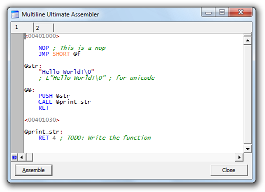

# Multiline Ultimate Assembler

Multiline Ultimate Assembler is a multiline (and ultimate) assembler (and
disassembler) plugin for [x64dbg](https://x64dbg.com/) and
[OllyDbg](http://www.ollydbg.de/). It's a perfect tool for modifying and
extending a compiled executable functionality, writing code caves, etc.

[🏠 Homepage](https://ramensoftware.com/multimate-assembler)

